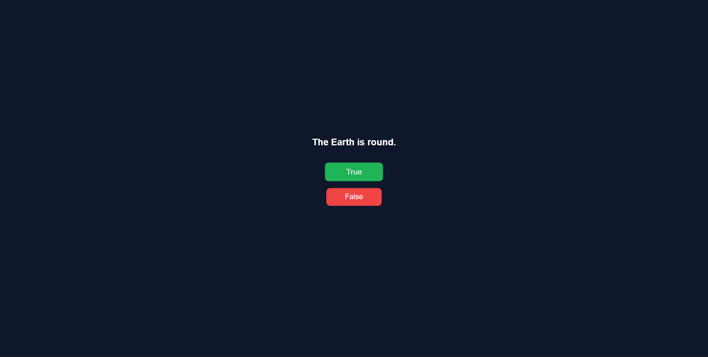
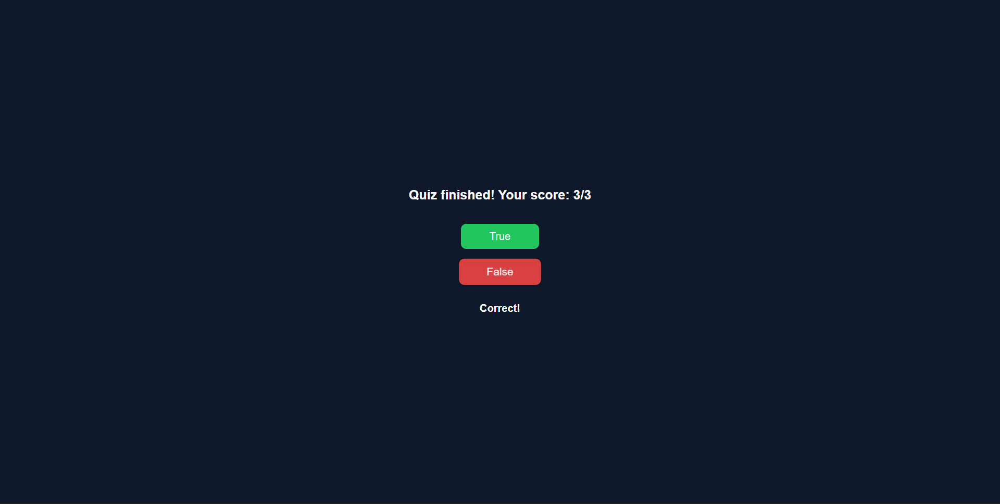

 
 
 


# True or False Quiz App

A simple **True or False quiz application** built using **HTML, CSS, and JavaScript**.  
The app displays questions dynamically, evaluates user answers, and shows the final score after completion.


## 🚀 Features

- Dynamic question rendering
- True / False answer buttons
- Instant feedback for answers
- Score calculation
- Simple and clean UI


## 🛠 Tech Stack

- HTML
- CSS
- JavaScript (Vanilla JS)


## ⚙️ How It Works

- A question is displayed on the screen  
- User clicks **True** or **False**  
- JavaScript checks the answer  
- Result is shown instantly  
- Final score is displayed after all questions  


## 📂 Project Structure

├── index.html  
├── style.css  
└── script.js  


## ✨ Features

- Dynamic question rendering  
- Instant answer feedback  
- Score tracking  
- Clean and responsive UI  
- Beginner-friendly logic  


## 🚀 Getting Started

1. Clone the repository  
   ```bash
   git clone https://github.com/dinishsg/true-false-quiz-js.git
2. Open index.html in your browser
3. Start answering the quiz


## 📸 Screenshots 

 
 


## 🌐 Live Demo 

🔗(https://dinishsg.github.io/true-false-quiz-js/)
